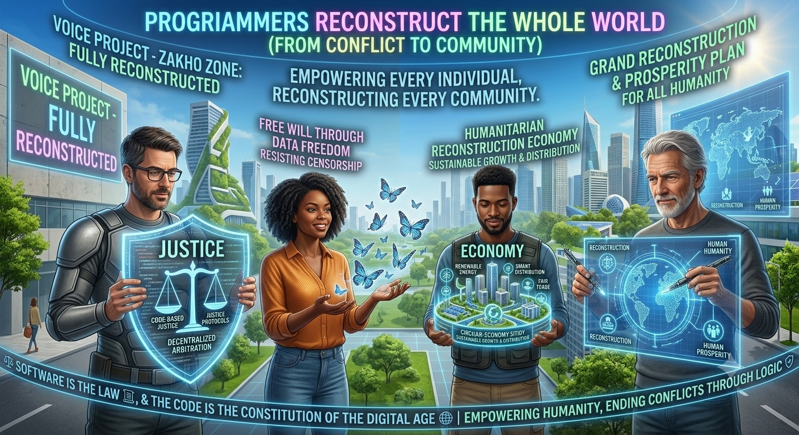

  

# 🌐 Voice (صوت)
### Voice in the Global Constitution / صوت في الدستور الكوني

> **"The software is the law, and the code is the constitution of the digital age."**
> *"البرمجيات هي القانون، والكود هو دستور العصر الرقمي."*

---

## 🌍 Universal Declarations / الإعلانات الكونية العالمية

### 🇺🇸 English
**Voice** is an open-source, decentralized platform engineered to establish the technological infrastructure for the next era of global human governance. By translating universal constitutional principles into immutable, self-executing smart contracts, we aim to transition systemic authority from centralized entities into a secure, transparent, and peer-to-peer digital ecosystem.

### 🇸🇦 العربية (الفصحى)
إن منصة **صوت** هي نظام تشغيل تكنولوجي لا مركزي ومفتوح المصدر، صُمم ليكون البنية التحتية البرمجية للجيل القادم من الحوكمة البشرية العالمية. نحن نهدف إلى تحويل نصوص الدستور الإنساني المشترك من مجرد وعود حبرية إلى بروتوكولات ذكية رقمية، ذاتية التنفيذ وغير قابلة للتلاعب، لتنتقل السلطة الحقيقية من الكيانات المركزية التقليدية إلى فضاء سيبراني آمن، شفاف، وقائم بالكامل على شبكات الند للند لحماية حقوق الشعوب.

### 🇨🇳 简体中文 (Chinese)
**Voice** 是一个开源的去中心化平台，旨在为下一代全球人类治理构建技术基础设施。通过将通用的宪法原则转化为不可篡改、自动执行的智能合约，我们的目标是将系统权力从传统中心化实体转移到一个安全、透明且点对点的数字生态系统中。

### 🇫🇷 Français (French)
**Voice** est une plateforme décentralisée et open-source conçue pour établir l'infrastructure technologique de la prochaine ère de la gouvernance humaine mondiale. En traduisant les principes constitutionnels universels en contrats intelligents immuables et auto-exécutables, notre objectif est de transférer l'autorité systémique des entités centralisées vers un écosystème numérique sécurisé, transparent et de pair à pair。

### 🇪🇸 Español (Spanish)
**Voice** es una plataforma descentralizada y de código abierto diseñada para construir la infraestructura tecnológica de la próxima era de la gobernanza humana global. Al traducir los principios constitucionales universales en contratos inteligentes inmutables y de ejecución automática, nuestro objetivo es transferir la autoridad sistémica de las entidades centralizadas hacia un ecosistema digital seguro, transparente y de igual a igual (P2P).

### 🇩🇪 Deutsch (German)
**Voice** ist eine Open-Source, dezentrale Plattform, die entwickelt wurde, um die technologische Infrastruktur für die nächste Ära globaler menschlicher Governance aufzubauen. Durch die Übersetzung universeller Verfassungsprinzipien in unveränderliche, selbstausführende Smart Contracts wollen wir die systemische Autorität von zentralisierten Institutionen in ein sicheres, transparentes und Peer-to-Peer-basiertes digitales Ökosystem überführen.

### 🇯🇵 日本語 (Japanese)
**Voice** は、次世代のグローバルな人類統治のための技術的インフラを構築するために設計された、オープンソースの分散型プラットフォームです。普遍的な憲法原則を改ざん不可能な自己実行型のスマートコントラクトに変換することにより、システム的な権限を従来の集権的エンティティから、安全で透明性の高いピアツーピア（P2P）のデジタルエコシステムへと移行させることを目指しています。

---

## ⚖️ أولاً: آليات المحكمة الرقمية الكونية (فصل القرارات)
في منصة **صوت**، نلغي المفهوم التقليدي للقضاء السياسي القائم على المصالح الجيوسياسية ونقده لنظام الفيتو، والبديل هو القضاء المستند إلى الحقيقة العلمية والرياضية القطعية المعروضة على البلوكشين مباشرة:
* **مجلس الحقيقة العلمية:** النزاعات الكبرى والمصيرية لا يفصل فيها سياسيون، بل لجان متخصصة تضم نخبة من العلماء، بما في ذلك علماء الجزيئات، الفيزيائيون، وخبراء البيئة والفلك.
* **العقود الذكية القضائية (Smart Oracles):** بمجرد صدور التقرير العلمي المدعوم بالحقائق الطبيعية، تنفذ بروتوكولات المنصة الأحكام تلقائياً برمجياً دون الحاجة لسلطات تنفيذية تقليدية.

---

## 🛡️ ثانياً: خط الحصانة والأمن السيبراني (مقاومة الحظر)
لحماية المنصة وأصوات الأفراد من اختراقات اللوبيات العالمية أو محاولات الحظر الرقمي من قِبل الدول، يعتمد الأمن السيبراني على ثلاثة خطوط دفاعية منيعة:
* **التشفير عديم المعرفة (Zero-Knowledge Proofs - ZKP):** يضمن التحقق من الهوية الرقمية الحيوية (المستندة إلى البيومترية) للمواطن العالمي والتأكد من حقه في التصويت، دون كشف هويته الحقيقية أو لمن أعطى صوته لمنع الملاحقة السياسية.
* **الشبكة الفيزيائية اللامركزية (DePIN):** الشبكة تعمل عبر آلاف العقد الموزعة بين هواتف وأجهزة الأفراد والمطورين حول العالم، مما يمنع الحكومات من حجبها أو إغلاقها.
* **مقاومة هجمات الحرمان من الخدمة (Anti-DDoS):** تشتيت الهجمات السيبرانية ضخمة الحجم تلقائياً عبر العقد اللامركزية الموزعة.

---

## 👑 ثالثاً: نظام الرتب والهيكل التنظيمي لـ "صوت"
* **رتبة المهندسين الأعظم (الـ 1300):** صفوة خبراء التشفير ومهندسي الأنظمة اللامركزية المسؤولين عن صيانة وتأمين الكود البرمجي الحصين.
* **رتبة المجالس العلمية الكونية:** تضم العلماء في كافة التخصصات الدقيقة (علماء الجزيئات، المناخ، الفيزياء) لصياغة المعايير وحل الأزمات بناءً على الحقائق.
* **رتبة المواطنة الرقمية السيادية:** كافة الأفراد المسجلين والموثقين حيوياً حول العالم، حيث يمتلك كل فرد وزناً تصويتياً متساوياً وعادلاً لرفض الحروب وحماية حقوق الشعوب.

---

## 🗺️ رابعاً: خارطة الطريق الاستراتيجية (Roadmap)
1. **المرحلة 1 (التأسيس):** توثيق الفصول الكاملة للدستور فكرياً وفلسفياً وفتح المستودع لجذب طليعة المهندسين (نواة الـ 1300).
2. **المرحلة 2 (البنية التحتية):** بناء بروتوكول التحقق الحيوي اللامركزي وإطلاق الشبكة التجريبية (Testnet) وتفعيل خط الدفاع المقاوم للحظر.
3. **المرحلة 3 (تفعيل القضاء واللجان):** تشكيل وتوثيق الرتب الخاصة بالمجالس العلمية وعلماء الجزيئات برمجياً وصياغة العقود الذكية للمحكمة الكونية.
4. **المرحلة 4 (الإطلاق الكوني الشامل):** فتح باب التصويت المباشر للأفراد على أولى القضايا الإنسانية المشتركة وفرض سلطة الفكر والشعوب تكنولوجياً.

---

## 📢 ميثاق التطوير المفتوح ونداء تاريخي عاجل
إن هذه الوثيقة وهذا المشروع **ليس قالباً جامداً ولا رؤية نهائية مغلقة**؛ بل هو حجر أساس بروتوكولي مرن وقابل للتوسع والتطوير المستمر. نؤمن بأن البرمجيات تتطور، ولذلك فإن هذا النظام متاح بالكامل أمام **المبرمجين الحقيقيين والنخب التقنية العالمية** لفحصه، وتعديل أي ثغرات أو أخطاء قد تظهر فيه، وتوسيعه بما يخدم مصلحة الكوكب وحل المشاكل البشرية.

هذا المشروع صُمم ليكتب التاريخ فصلاً جديداً من فصول العدالة؛ فهو **صالح لكل البشرية بلا تمييز، ولا يصطدم مطلقاً مع مواثيق الأمم المتحدة، أو الإعلان العالمي لحقوق الإنسان، أو سيادات الحكومات القائمة**، بل يمثل أداة تكنولوجية مساندة ومطورة لحل الأزمات.

> **نداء خاص:** إن هذه الفرصة التاريخية لبناء نظام تشغيل رقمي عادل للحضارة البشرية هي فرصة حية الآن، وقد لا تتكرر في يوم آخر. إن التاريخ يفتح بابه لمن يمتلك القدرة على التدخل والمساهمة بأسرع وقت ممكن. كل مطور، عالم، أو مهندس يضع لبنة في هذا البناء اليوم، سينال شرفاً تاريخياً كبيراً في وجدان البشرية وأمام أجيال المستقبل.

---

## 🎯 أهداف ومميزات المشروع الإستراتيجية
* **للبشرية:** منح كل إنسان صوتاً حقيقياً ومباشراً في القرارات الكونية (كالمناخ والصحة) دون وسطاء، مع حماية الخصوصية المطلقة والسيادة الرقمية وتفكيك الحدود فلسفياً.
* **للحكومات:** تحقيق الاستقرار العام وحماية الدول من استنزاف الحروب عبر حل النزاعات سلمياً، وتوفير إدارة علمية محايدة للأزمات المحلية (كالجفاف والأوبئة)، وبناء جسور فكرية وثقافية عبر دبلوماسية شعبية.
* **للأمم المتحدة:** دعم وتطوير المنظومة الدولية وتحويل القرارات الإنسانية لمواثيق الأمم المتحدة إلى بروتوكولات ذكية نافذة برمجياً، وتفكيك نفوذ جماعات الضغط واللوبيات العالمية، وتقديم آلية إنفاذ قضائية لامتناهية الشفافية تضمن السلم والأمن الدوليين.

---

## 📜 شهادة وتوقيع وتاريخ الإطلاق
ليشهد التاريخ، وتستذكر الأجيال القادمة، أنني كنت منحازاً لحقوق البشرية، ومدافعاً عن كرامة الإنسان، وأتممت هذا المشروع وأطلقته للعالم بقلب مخلص وفكر يتطلع إلى السلام والعدالة المطلقة.

* **تاريخ الإتمام الموثق:** 18 تموز (يوليو) 2026
* **مُبتكر ومؤلف الدستور الكوني:** صابر يوسف كريت يوسف (زاخو)
